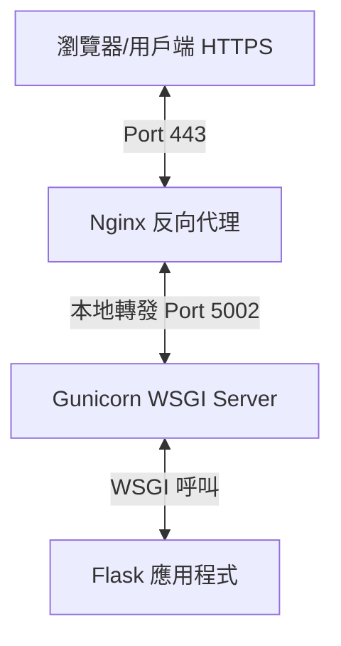

# 智能客服系統正式部署與架構指南 (Gunicorn + Nginx + HTTPS)

本指南詳細說明如何將 Flask 智能客服系統部署至雲端虛擬伺服器（如 Ubuntu VPS），並配置 **Gunicorn**、**Nginx** 與 **Certbot (Let's Encrypt HTTPS)**。

---

## 1. 部署架構與角色說明 (期末報告重點)

正式部署時，我們不建議直接使用 Flask 內建的測試伺服器 (`flask run` 或 `app.run()`)，因為它是**單執行緒（Single-threaded）**的，只適合開發除錯。在高併發、高流量或生產環境下，必須採用以下多層架構：



### 各元件的角色定位：
1. **Flask (Python Web 應用程式)**：
   * **角色**：負責處理**商業邏輯**、資料讀取、AI 語意相似度檢索（RAG）並回傳 JSON/HTML。
   * **特色**：不擅長處理連線管理、靜態檔案緩存或高併發。

2. **Gunicorn (WSGI HTTP 伺服器)**：
   * **角色**：作為 Flask 與外部伺服器之間的**橋樑**。
   * **特色**：它會建立多個背景工作程序（Workers），能同時處理多個用戶請求。當某個 Python 程式當機或超時，Gunicorn 會自動重啟該程序，保證服務不中斷。

3. **Nginx (反向代理與網頁伺服器)**：
   * **角色**：位於架構最前端的**大門守衛**。
   * **特色**：
     * **安全防護**：不暴露後端 Gunicorn/Flask 的真實埠號。
     * **負載平衡**：可將流量分發至多個後端伺服器。
     * **靜態檔案分發**：Nginx 處理靜態檔案（CSS、JS、圖片）的速度極快，不佔用後端 Python 計算資源。
     * **SSL/TLS 終端**：在 Nginx 端直接處理 HTTPS 加密解密，後端只需處理明文的 HTTP 請求。

4. **Certbot & Let's Encrypt (SSL 加密憑證)**：
   * **角色**：自動申請與更新免費的 SSL/TLS 憑證。
   * **特色**：將網站從不安全的 `http://` 升級為加密的 `https://`，並可設定自動排程（Cron Job）每 90 天自動更新憑證。

---

## 2. 逐步部署教學

以 Ubuntu 伺服器為例：

### 步驟 1：安裝系統依賴與專案下載
```bash
# 更新系統套件
sudo apt update && sudo apt upgrade -y

# 安裝 Python, Pip, Nginx, git 及虛擬環境套件
sudo apt install python3-pip python3-venv nginx git -y
```

將您的專案程式碼上傳或複製到伺服器（例如 `/home/ubuntu/cloud-project/`）。

### 步驟 2：設定 Python 虛擬環境與安裝套件
```bash
cd /home/ubuntu/cloud-project/

# 建立並啟用虛擬環境
python3 -m venv venv
source venv/bin/activate

# 安裝專案所需套件
pip install -r requirements.txt
pip install gunicorn
```

### 步驟 3：使用 Systemd 守護程式管理 Gunicorn
為了解決關閉終端機（Terminal）後服務就斷線的問題，我們建立一個 systemd 系統服務檔：

```bash
sudo nano /etc/systemd/system/cloud-project.service
```

貼入以下內容：
```ini
[Unit]
Description=Gunicorn instance to serve AI Customer Service Flask App
After=network.target

[Service]
User=ubuntu
Group=www-data
WorkingDirectory=/home/ubuntu/cloud-project
Environment="PATH=/home/ubuntu/cloud-project/venv/bin"
ExecStart=/home/ubuntu/cloud-project/venv/bin/gunicorn --config gunicorn_config.py app1:app

[Install]
WantedBy=multi-user.target
```

啟動並啟用該服務，讓它隨系統自動開機啟動：
```bash
sudo systemctl daemon-reload
sudo systemctl start cloud-project
sudo systemctl enable cloud-project

# 檢查狀態，應顯示 active (running)
sudo systemctl status cloud-project
```

### 步驟 4：設定 Nginx 反向代理
1. 將專案中的 `nginx.conf` 範本複製到 Nginx 的設定目錄：
   ```bash
   sudo cp nginx.conf /etc/nginx/sites-available/cloud-project
   ```
2. 編輯該設定檔，將其中的 `yourdomain.com` 修改為您實際的網域名稱，並將靜態目錄路徑設定正確：
   ```bash
   sudo nano /etc/nginx/sites-available/cloud-project
   ```
3. 建立軟連結啟用此設定，並刪除 Nginx 預設設定：
   ```bash
   sudo ln -s /etc/nginx/sites-available/cloud-project /etc/nginx/sites-enabled/
   sudo rm /etc/nginx/sites-enabled/default
   ```
4. 測試 Nginx 設定語法是否正確，並重新啟動：
   ```bash
   sudo nginx -t
   sudo systemctl restart nginx
   ```

### 步驟 5：申請 SSL 憑證 (啟用 HTTPS)
使用 Certbot 工具自動向 Let's Encrypt 申請 SSL 憑證並自動修改 Nginx 設定：

```bash
# 安裝 Certbot 及其 Nginx 外掛
sudo apt install certbot python3-certbot-nginx -y

# 申請憑證並自動設定 Nginx（Certbot 會讀取 nginx.conf 中的 server_name）
sudo certbot --nginx -d yourdomain.com -d www.yourdomain.com
```
在申請過程中，輸入您的 Email 並同意條款，Certbot 會自動幫您修改 `/etc/nginx/sites-available/cloud-project` 檔案，自動加入憑證路徑，並重啟 Nginx。

---

## 3. 常見部署除錯 (Q&A)

* **Q：連線出現 502 Bad Gateway？**
  * **A**：這代表 Nginx 已經運行，但無法連接後端的 Gunicorn。請使用 `sudo systemctl status cloud-project` 檢查 Gunicorn 是否正常啟動，並確認 Gunicorn 監聽的 Port 是否與 `nginx.conf` 中的 `proxy_pass`（5002）一致。

* **Q：網頁讀不到 static 內的圖片或樣式？**
  * **A**：請確認 `nginx.conf` 中 `location /static/` 的 `alias` 路徑是否正確，且該目錄的權限允許 Nginx 讀取 (`sudo chmod -R 755 /home/ubuntu/cloud-project`)。

* **Q：雲端主機 (VPS) 記憶體不足，啟動 Gunicorn/Flask 時程式直接被系統 Kill 或是卡死？**
  * **A**：這是因為 `Qwen/Qwen2.5-3B-Instruct` 大模型在沒有量化的情況下需要約 **6GB 記憶體**。若您的雲端主機記憶體較小（例如 1GB/2GB/4GB RAM），且 Gunicorn 預設啟動了多個工作行程 (Workers)，伺服器記憶體會瞬間被榨乾。
  * **解決方案**：
    1. **降低工作行程數**：將 `gunicorn_config.py` 中的 `workers` 寫死設定為 `1`。這樣 Gunicorn 只會載入一份大模型。
    2. **替換為極速輕量版大模型**：將 `app1.py` 中的 `LLM_MODEL_NAME` 修改為輕量級的 `Qwen/Qwen2.5-0.5B-Instruct`（僅需約 1GB 記憶體）或 `Qwen/Qwen2.5-1.5B-Instruct`（約 3GB 記憶體）。對於一般的 RAG 客服問答，0.5B 和 1.5B 模型的理解力就已經非常足夠，且生成速度更快！
    3. **啟用 Swap 虛擬記憶體**：在 Ubuntu 上建立並啟用 4GB~8GB 的 Swap 檔，避免因記憶體不足 (OOM) 導致行程直接被核心砍掉。

